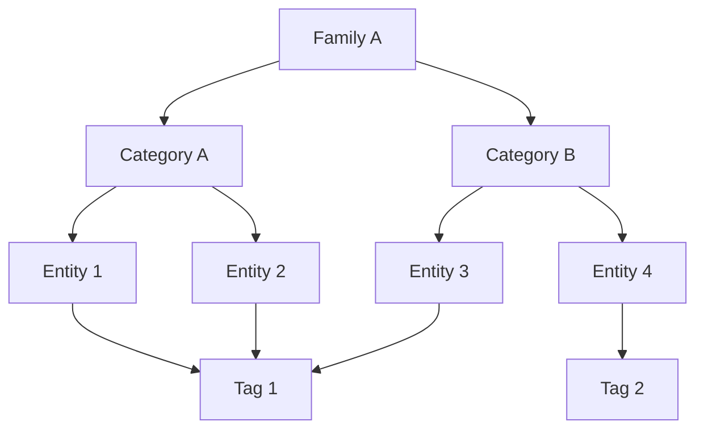
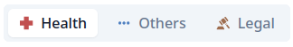

# Understanding the data model

## Overview

The datamodel is composed of the following classes of objects:

### Families

A family is defining the data model for all entities that are part of it:
- The entity form defines the fields that are available for the entities of the family.
- The comment form defines the fields that are available for the comments of the entities of the family.

Each family can have multiple categories.

They are displayed on the top of the map and is used to switch the context of the map itself:

On this screenshot we have 3 families: `Health`, `Others` and `Legal`.

### Categories

A category is a way to group entities together. Categories are responsible for theming the entities on the map.
Each category can have multiple entities, but an entity can only belong to one category.

### Entities

They are the points on the map. They have a dynamic data column which is defined by the family they belong to.

Entities can have parent entities. When an entity has a parent, it will be displayed as a child of the parent entity on the map.

### Comments

Comments are attached to entities. They have a dynamic data column which is defined by the family to which the entity they belong to belongs to.

### Tags

Tags are attached to entities. They are primarily used to filter efficiently the entities on the map.
They are shared between all entities, regardless of the family they belong to.

Some of them can be noted as "filtering" so they take a special place in the filter panel.
